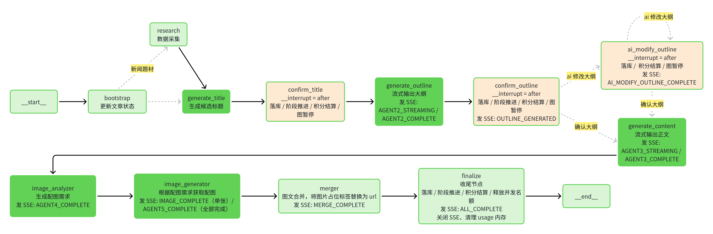

# 🚀 AI 文章创作平台

<div align="center">

**输入一个主题，LangGraph 多智能体自动完成选题研究、标题、大纲、正文与配图，产出图文并茂的完整文章**

      


</div>

## 📖 项目简介

本项目是一个 **AI 驱动的文章创作平台**。用户只需输入一个主题，系统便会通过 **LangGraph 状态机** 编排多个 LLM 智能体，自动完成「选题研究 → 标题生成 → 大纲规划 → 正文创作 → 配图生成 → 图文合并」，最终产出一篇图文并茂的完整文章。

创作过程支持 **多阶段人机协同**：标题、大纲等关键节点会暂停等待用户确认或修改；新闻题材会自动接入信息采集智能体，基于实时资讯创作。平台同时内置**注册登录**、**积分计费**、**VIP 会员**、**管理后台**、**意见反馈**与**站内信**等能力。

## ✨ 核心功能

### 🤖 智能体

LangGraph 编排 **6 个创作智能体 + 1 个新闻信息采集智能体**：

| 智能体 | 职责 |
| :--- | :--- |
| 🧠 标题生成 | 分析选题，生成 3~8 个标题方案供用户选择 |
| 📋 大纲生成 | 规划文章结构与章节，支持用户编辑 / AI 修改 |
| 🐳 修改大纲 | AI 根据已有大纲和用户要求重新生成大纲 |
| ✍️ 正文创作 | 按大纲流式生成 Markdown 正文与图片占位标签 |
| 🧭 配图分析 | 分析正文内容，产出配图需求与插图位置 |
| 🎨 配图生成 | 按需求并行拉取 / 生成配图并上传 |
| 📰 信息采集 | 新闻题材专用：Serper 搜索 + ddgs 获取 markdown 格式内容 + 抽取结构化摘要 + 选择最符合选题的新闻 |


<div align="center">

**Graph 架构**

</div>




其中 `confirm_title`、`confirm_outline`、`ai_modify_outline` 是 3 个人机协同 interrupt 断点：先落库并发 SSE，再暂停等待用户确认；由 SQLite Checkpointer 持久化，支持断点续跑。大纲确认后既可手动编辑，也可循环请求 AI 修改。

### 🖼️ 配图方式

配图分析智能体会根据正文自动选择合适的配图方式，失败时自动降级兜底：

| 方式 | 说明 |
| :--- | :--- |
| 🏞️ Pexels | 高质量真实场景图库检索 |
| 🤖 智谱 AI 生图 | AI 生图（配置 API Key 后自动启用） |
| 📊 AI-SVG 图表 | LLM 生成矢量示意图 |
| 📐 Mermaid | 流程图 / 时序图等结构化图表（需 `mmdc` CLI） |
| 🎯 Iconify | 海量开源图标库检索 |
| 😂 Bing 表情包 | 表情包图片搜索 |
| 🔁 Picsum | 兜底随机图，任何服务失败自动降级 |

所有配图服务统一继承 `BaseImageSearchService`，由 `ParallelImageGenerator` 并行调度；普通 / VIP 配图方式按会员权限门控，可用服务动态同步到创作页选项。

### 📰 预设题材

| 题材 | 说明 |
| :--- | :--- |
| 📰 news 新闻资讯 | 触发信息采集 Agent，基于实时新闻创作 |
| 🧠 knowledge 知识科普 | 概念 / 原理类科普文章 |
| 🚀 product 产品介绍 | 产品功能与卖点介绍 |
| 🛠️ tutorial 教程指南 | 步骤化操作教程 |
| 💭 opinion 观点评论 | 有立场的观点文章 |
| 📖 story 故事叙事 | 故事化叙事文章 |

### 🎨 预设语言风格

| 风格 | 说明 |
| :--- | :--- |
| 🎓 professional | 专业严谨 |
| 💬 accessible | 通俗易懂 |
| 😄 humorous | 活泼幽默 |
| 🌸 literary | 文艺抒情 |
| 📋 formal | 正式客观 |

### ⚡ SSE 实时通信

- 生成进度实时推送：标题 / 大纲 / 正文 / 配图 / 合并 / 完成 / 错误等阶段事件
- 正文与大纲支持 **流式输出**，打字机式展示创作过程
- 历史事件可重放：`GET /api/article/progress/{taskId}?after=<seq>` 断点续传
- 重新进入创作页用 `?taskId=` 恢复上次进度，含流式大纲 / 正文中断点恢复

### 🛠️ 管理员

- 📊 数据看板：用户数、文章数、创作统计等概览
- 👥 用户管理：用户查询、状态与角色管理
- 💰 积分管理：管理员积分调整与流水查看
- 🧮 模型计价：各 LLM / 生图模型积分单价 CRUD
- 📨 意见反馈管理：集中筛选、处理与回复反馈
- 📣 站内信管理：单发 / 批量 / 全体广播站内信

### 📮 意见反馈

- 支持 BUG / FEATURE / COMPLAINT / OTHER 类型
- 可上传最多 5 张截图（单张 ≤ 2MB），填写联系方式
- 反馈状态全程可跟踪（PENDING / PROCESSING / RESOLVED）
- 管理员回复后自动发送站内信通知用户
- Redis 固定窗口每日限流，防刷

### 🔔 站内信

- 系统通知 / 反馈回复 / VIP 开通 / 积分变动等类型
- 头部铃铛展示未读角标，分页未读优先
- 支持单条 / 全部标记已读、删除
- 管理员可向单个 / 批量 / 全体用户发送消息

## 📦 其他功能

- ✅ 文章管理：列表、详情、删除，支持导出 Markdown / HTML
- ✅ 信息采集可视化：新闻题材展示搜索词与新闻条目，可回看
- ✅ 创作进度恢复：SSE 历史重放 + `?after=` 断点续传
- ✅ 用户体系：注册 / 登录 / 个人主页 / 账号设置（头像、昵称、简介、密码）
- ✅ 积分系统：注册赠送、每日签到、后付费段级结算、明细分页、模型用量统计
- ✅ 配额与并发控制：透支护栏 + 单用户并发限制（原子 SQL 计数）
- ✅ VIP 会员：一键**免费**开通永久 VIP（限时免费，Stripe 尚未打通）
- ✅ 安全防护：注册 / 登录 Redis 限流防爆破、任务去重、上传文件白名单
- ⏳ 内容审核 Agent（review）：规划中
- ⏳ 用户上传配图、全局并发限制：规划中

## 🏗️ 技术栈

### 🖥️ 后端

| 层级 | 技术 |
| :--- | :--- |
| 语言 / 框架 | Python 3.11（>= 3.10）、FastAPI 0.115、uv |
| 智能体编排 | LangGraph 1.1、LangChain（`create_agent` 信息采集）、SQLite Checkpointer |
| 数据访问 | SQLAlchemy 2.0、databases（异步）、Pydantic 2 |
| 存储 | MySQL（业务数据）、Redis（Session / 去重 / 限流）、SQLite（图检查点）、本地文件（图片） |
| LLM | DeepSeek、小米 MiMo（按智能体独立配置，空值回退全局默认） |
| 配图 | Pexels、智谱 AI 生图、Mermaid CLI、Iconify、Bing、AI-SVG、Picsum |
| 其他 | Serper 搜索、json_repair、ddgs 网页内容抓取 |

### ⚙️ 前端

| 模块 | 技术 |
| :--- | :--- |
| 框架 | Vue 3.5、Vite 8、TypeScript |
| UI | Ant Design Vue 4、ECharts |
| 状态 / 路由 | Pinia、Vue Router 4 |
| 网络 | Axios、EventSource（SSE 封装） |
| API 客户端 | @umijs/openapi（openapi2ts 自动生成） |
| 工具 | marked + dompurify（Markdown 渲染）、vuedraggable（大纲拖拽）、dayjs |

## 🚀 快速开始

环境要求：Python 3.10+（推荐 3.11）、Node.js `^22.18.0 || >=24.12.0`、`MySQL>=8.0`、Redis、uv。

```bash
# 1. 创建虚拟环境
cd backend
uv sync

# 2. 配置环境变量（数据库 / Redis / LLM / 配图等密钥）
cp .env.example .env

# 3. 初始化数据库（幂等建库建表，DDL 与 backend/sql/init_db.sql 一致）
uv run python scripts/init_db.py

# 4.（可选）种子数据（演示账号 / 管理员账号 / 模型计价）
uv run python scripts/seed_data.py

# 5. 启动后端（端口 8567）
uv run python -m uvicorn app.main:app --reload --host 0.0.0.0 --port 8567

# 6. 启动前端（端口 5173，另开终端）
cd frontend
npm install
npm run dev
```

- 浏览器访问 `http://localhost:5173` 开始创作
- API 文档：`http://localhost:8567/api/docs`
- 可选：Mermaid 配图需全局安装 `npm install -g @mermaid-js/mermaid-cli`
- 用户种子数据：
  账号 | 密码 | 角色
  :-:|:-:|:-:
  admin|12345678|管理员
  user|12345678|普通用户
  test|12345678|普通用户


### 环境变量说明

#### 主要变量

| 分组 | 变量名 | 必须 | 默认值 | 说明 | 获取地址
| :--- | :--- | :-: | :-: | :-: | :-:
| 安全 | `trust_forwarded_headers` | - | `false` | 是否信任反向代理传递的 `X-Forwarded-For`（直连 uvicorn 保持 False，防止伪造头绕过限流） | - |
| 数据库 | `DB_HOST` / `DB_PORT` / `DB_NAME` / `DB_USER` / `DB_PASSWORD` | ✅ | `localhost` / `3306` / `ai_passage_creator` / `root` / 空 | MySQL 业务库连接信息 | - |
| Redis | `REDIS_HOST` / `REDIS_PORT` / `REDIS_DB` / `REDIS_PASSWORD` | ✅ | `localhost` / `6379` / `0` / 空 | Session、任务去重、限流 | - |
| 会话 | `SESSION_SECRET_KEY` | ✅ | `your-secret-key-change-in-production` | Session 签名密钥，生产环境务必更换 | - |
| LLM | `DEEPSEEK_API_KEY` | ✅ | 无 | DeepSeek API 密钥，默认 LLM 及各智能体 | https://platform.deepseek.com/api_keys |
| LLM | `MIMO_API_KEY` | ✅ | 空 | 小米 MiMo API 密钥，信息采集主 Agent 使用，不填需改信息采集 Agent 配置 | https://platform.xiaomimimo.com/console/api-keys |
| LLM | `DEFAULT_LLM_PROVIDER` / `DEFAULT_MODEL` | - | `deepseek` / `deepseek-v4-flash` | 全局默认 LLM 提供方与模型（各智能体可独立覆盖） | - |
| 信息采集 | `SERPER_API_KEY` | - | 空 | Serper 新闻搜索密钥（新闻题材信息采集用） | https://serper.dev/api-keys （2500 免费额度） |
| 配图 | `PEXELS_API_KEY` | ✅ | 无 | Pexels 图片搜索密钥 | https://www.pexels.com/api/key/ （免费）|
| 配图 | `ZHIPU_API_KEY` | - | 空 | 智谱 AI 生图密钥（为空则跳过该服务），默认使用 `cogview-3-flash` 免费模型，并发限制 `1` | https://bigmodel.cn/apikey/platform |
| 监控 | `LANGSMITH_TRACING` / `LANGSMITH_ENDPOINT` / `LANGSMITH_API_KEY` / `LANGSMITH_PROJECT` | - | 空 | LangSmith 运行追踪（可选，观察 graph / LLM 调用） | https://smith.langchain.com/o/5a128a15-3fab-4fb9-b232-93f743e4b226/settings/apikeys, https://smith.langchain.com/o/5a128a15-3fab-4fb9-b232-93f743e4b226/projects |

> 更多配置见 `.env.axample` 和 `backend/app/config/`

## 🗄️ 数据库设计

业务数据统一存储在 MySQL 数据库 `ai_passage_creator`，共 **10 张表**：

| 分组 | 表 | 职责 |
| :--- | :--- | :--- |
| 用户域 | `user` | 账号、角色、会员、并发任务计数 |
| 创作域 | `article` | 创作任务与文章产物（标题 / 大纲 / 正文 / 配图 / 研究数据） |
| 创作域 | `agent_log` | 智能体执行日志（Prompt / 输入输出 / 耗时 / 模型） |
| 支付域 | `payment_record` | 支付流水 |
| 积分域 | `user_points` | 积分余额账户 |
| 积分域 | `points_transaction` | 积分变动流水 |
| 积分域 | `model_pricing` | 各模型积分单价配置 |
| 积分域 | `model_usage_record` | 模型调用 / token / 图片用量与成本 |
| 反馈域 | `feedback` | 意见反馈与管理员处理 |
| 消息域 | `message` | 系统通知 / 反馈回复 / VIP 开通 / 积分变动的站内信 |

辅助存储：

- 🧱 **Redis**：Session、任务去重键、注册登录限流、统计缓存
- 📦 **SQLite**：LangGraph 检查点（`backend/data/checkpoints.sqlite`），支撑断点续跑
- 🗂️ **本地文件**：生成图片落盘（`backend/static/images/`），`/static` 挂载访问

DDL 唯一源为 `backend/sql/init_db.sql`，ORM 权威定义在 `backend/app/models/`；MySQL 列名统一 camelCase，ORM 字段使用 snake_case 映射。

---

## 📁 项目目录结构


```text
passage-ai/
├── README.md                             # 说明
├── docs/                                 # 文档 / 图片
│
├── backend/                              # 后端
│   ├── .env.example / pyproject.toml / uv.lock   # 环境变量示例 / 依赖与锁文件
│   ├── app/
│   │   ├── main.py                       # 入口
│   │   ├── config/                       # 配置包
│   │   ├── database.py / redis.py / deps.py / exceptions.py   # MySQL/Redis 连接、依赖注入、业务异常
│   │   ├── count_semaphore.py            #   进程内信号量（智谱生图限并发）
│   │   ├── graph/                        # ⭐ LangGraph 文章生成状态机
│   │   │   ├── builder.py / constants.py #   图拓扑组装 / 节点常量
│   │   │   ├── checkpointer.py           #   SQLite 检查点
│   │   │   ├── graph_runner.py           #   graph 调度
│   │   │   ├── sse_bridge.py             #   图节点 → SSE 消息转换
│   │   │   ├── edges/                    #   条件边
│   │   │   └── nodes/                    #   图节点
│   │   ├── agent/                        #   LLM 智能体层
│   │   │   ├── orchestrator.py           #   智能体编排器
│   │   │   ├── base_agent.py / context/  #   智能体基类 / 流式输出处理
│   │   │   ├── agents/                   #   创作智能体
│   │   │   └── information_collector/    #   数据采集智能体
│   │   ├── llm_factory/                  #   LLM 模型工厂
│   │   ├── routers/                      #   路由层
│   │   ├── services/                     #   服务层
│   │   ├── models/ / schemas/            #   ORM + enums / Pydantic 请求响应模型
│   │   ├── managers/sse_manager.py       #   SSE 连接管理
│   │   |── constants/                    #   常量 / LLM 提示词
        |__ utils/
│   ├── sql/init_db.sql
    |—— scripts/                          #   数据库初始化等脚本
│   └── static/default_avatar/            #   头像种子图
│
└── frontend/                             #   前端
    ├── vite.config.js / index.html / package.json   # 构建配置、入口、依赖
    ├── openapi.json / openapi2ts.config.ts          # API 快照 + 生成接口客户端
    └── src/
        ├── main.js / App.vue / request.ts / access.ts  # 入口 / Axios 封装 / 路由权限
        ├── router/index.js / stores/loginUser.ts       # 路由表 / Pinia 当前用户
        ├── api/                                        # openapi2ts 生成的接口客户端
        ├── layouts/BasicLayout.vue                     # 主布局（全局头 / 页脚）
        ├── components/                                 # GlobalHeader / GlobalFooter / 创作页组件
        ├── pages/                                      # 页面
        ├── utils/
        └── constants/ types/ assets/                   # 常量 / 类型声明 / 静态资源
```

---

<div align="center">Made with ❤️ | 智能创作 · 一键成文</div>

