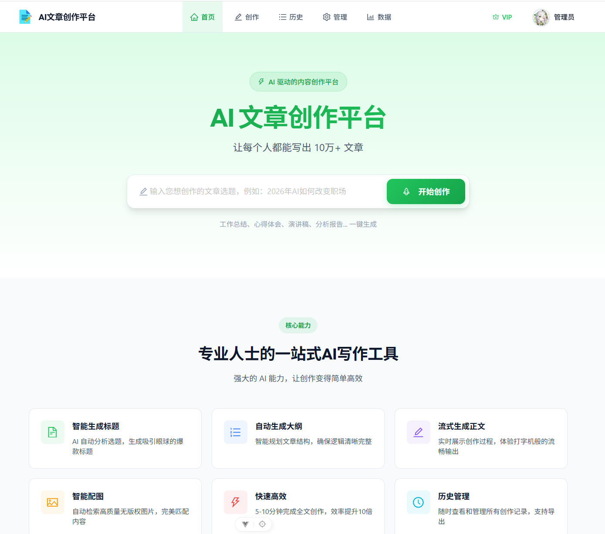
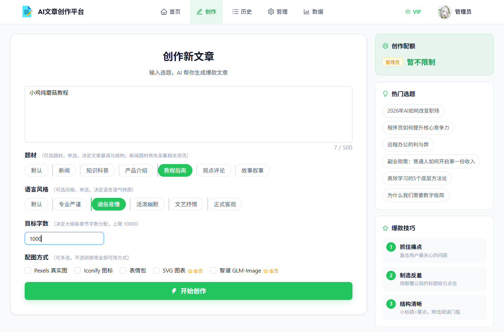
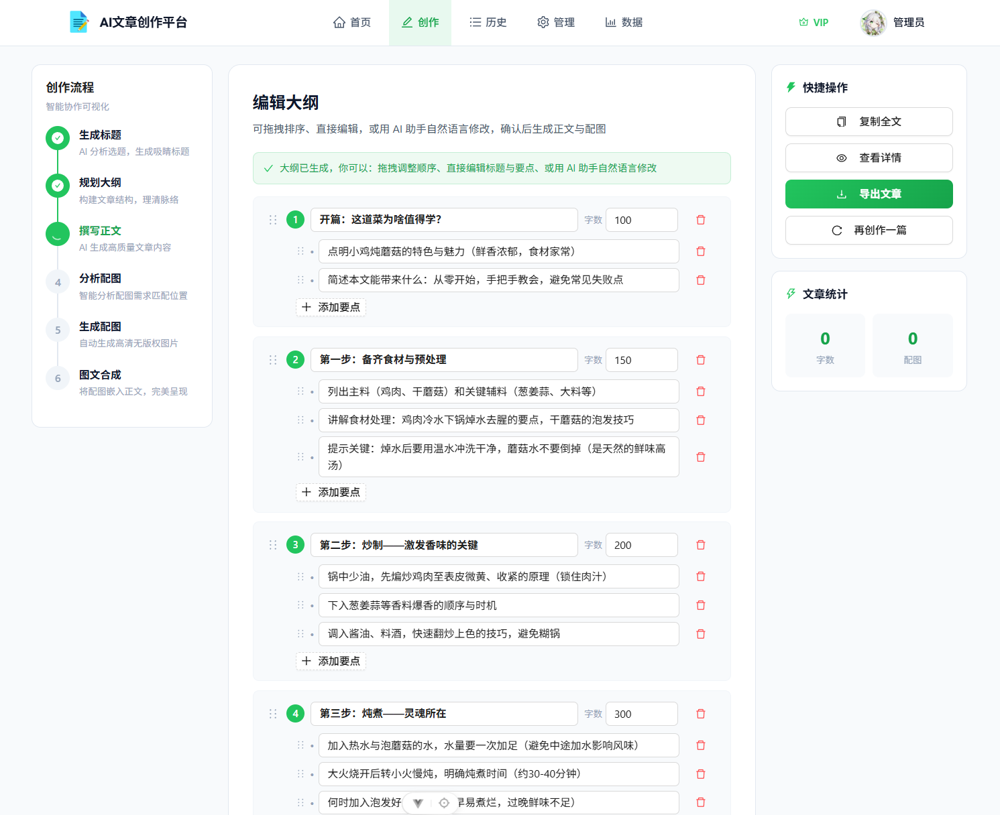
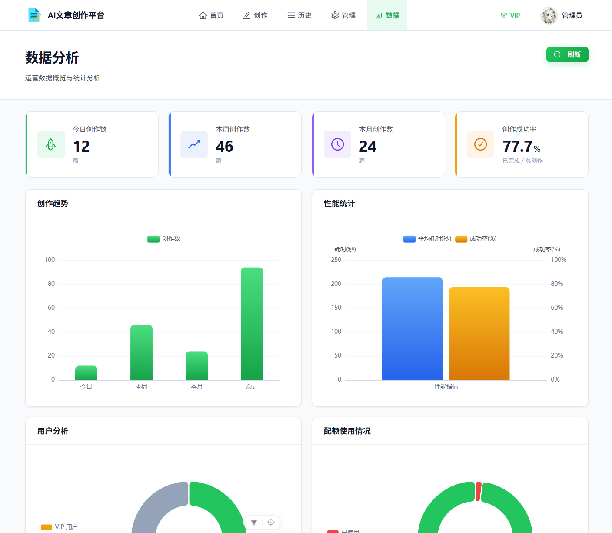

# 🚀 AI 文章创作平台

> 基于多智能体编排的 AI 文章生成平台，输入一个主题，即可自动产出带标题、大纲、正文与配图的完整文章。

     

## 📖 项目简介

本项目是一个 **AI 驱动的文章创作平台**。用户只需输入一个主题，系统便会通过 **LangGraph 状态机** 编排多个 LLM 智能体（Agent），自动完成选题研究、标题生成、大纲规划、正文创作、配图生成与排版合并，最终产出一篇图文并茂的完整文章。

整个创作过程支持 **多阶段人机协同**：在标题、大纲等关键节点会暂停等待用户确认或修改，保证生成结果符合用户预期。

## ✨ 核心特性

- 🧠 **多智能体编排**：LangGraph 状态机调度 6 个创作智能体（标题、大纲、正文、图片分析、图片生成、内容合并）
- 🤝 **人机协同断点**：标题确认、大纲确认、AI 修改大纲 3 个中断点，边生成边确认
- 📰 **新闻选题研究**：资讯类主题自动接入信息收集智能体，基于实时新闻创作
- 🖼️ **多源配图**：Pexels 图库、AI 生图、Mermaid 图表、Iconify 图标、Bing 表情包、SVG 图表等，失败自动降级
- ⚡ **实时进度流**：SSE 推送生成进度，正文、大纲等流式输出
- 👤 **用户体系**：注册 / 登录 / VIP 会员 / 配额管理
- 📊 **数据看板**：后台统计图表与用户管理
- 💳 **在线支付**：Stripe 集成，一键开通 VIP

## 🖼️ 界面预览

| 首页 | 创建文章 |
| :---: | :---: |
|  |  |

| 大纲编辑 | 文章详情 |
| :---: | :---: |
|  |  |

| 统计看板 |
| :---: |
|  |

## 🏗️ 系统架构

### 多智能体创作流水线

```
START → bootstrap → [新闻类?] → research → generate_title → confirm_title [⏸ 人工确认]
       → generate_outline → confirm_outline [⏸ 人工确认]
       → [需要修改?] → ai_modify_outline [⏸ 循环可改]
       → generate_content → image_analyzer → image_generator → merger → finalize → END
```

- **副作用节点**（写库 + 发 SSE）：`bootstrap`、`confirm_title`、`confirm_outline`、`ai_modify_outline`、`finalize`
- **智能体节点**（纯 LLM 工作 + 流式 SSE）：`generate_title`、`generate_outline`、`generate_content`、`image_analyzer`、`image_generator`、`merger`
- **研究节点**（仅新闻类）：`research`，通过信息收集智能体检索相关新闻

### 技术栈

| 层级 | 技术 |
| :--- | :--- |
| 🖥️ 前端 | Vue 3、Vite、Ant Design Vue、Pinia、Vue Router、ECharts |
| ⚙️ 后端 | Python 3.10+、FastAPI、SQLAlchemy、databases |
| 🧬 编排 | LangGraph、LangChain、SQLite Checkpointer（断点续跑） |
| 🗄️ 存储 | MySQL、Redis、本地文件存储（原腾讯云 COS） |
| 🤖 LLM | DeepSeek、小米 MiMo（按智能体可独立配置） |
| 🖼️ 图片 | Pexels、智谱 GLM-Image、Nano Banana（Gemini）、Mermaid CLI、Iconify、Bing 表情包 |
| 💳 支付 | Stripe |

## 🚀 快速开始

### 环境要求

- Python 3.10+
- Node.js 22.18+（或 24.12+）
- MySQL、Redis

### 1️⃣ 启动后端（端口 8567）

```bash
cd backend

# 配置环境变量（参考 .env.example，包含数据库、Redis、各 LLM 与图片服务密钥）
cp .env.example .env

# 安装依赖并启动
uv run python -m uvicorn app.main:app --reload --host 0.0.0.0 --port 8567
```

### 2️⃣ 启动前端（端口 5173）

```bash
cd frontend
npm install
npm run dev
```

浏览器访问 `http://localhost:5173` 即可开始创作。

### 3️⃣ Stripe 支付回调（可选）

```bash
stripe login
stripe listen --forward-to localhost:8567/api/webhook/stripe
```

## 📁 项目结构

```
├── backend/                  # FastAPI 后端
│   └── app/
│       ├── graph/            # LangGraph 状态机（节点、边、检查点、SSE 桥接）
│       ├── agent/            # LLM 智能体（6 个创作智能体 + 信息收集智能体）
│       ├── llm_factory/      # LLM 提供商抽象（DeepSeek / MiMo）
│       ├── routers/          # REST API 路由
│       ├── services/         # 业务逻辑与图片服务
│       ├── models/           # SQLAlchemy ORM 模型
│       └── schemas/          # Pydantic 请求 / 响应模型
├── frontend/                 # Vue 3 前端
│   └── src/
│       ├── pages/            # 页面（首页、创作、详情、VIP、后台管理）
│       ├── components/       # 组件（执行日志面板、大纲编辑器）
│       ├── api/              # OpenAPI 自动生成的 API 客户端
│       └── utils/            # SSE 封装、Markdown 渲染、权限等工具
├── screenshots/              # 应用截图
└── LICENSE                   # MIT License
```

## 🤝 人机协同创作流程

1. 📝 用户输入主题，调用 `POST /api/article/create` 开始创作，图运行到「标题确认」暂停
2. 🎯 用户选择标题，调用 `POST /api/article/confirm-title` 继续，图运行到「大纲确认」暂停
3. ✏️ 用户可编辑大纲或请求 AI 修改（`POST /api/article/ai-modify-outline`，可循环）
4. ✅ 用户确认大纲（`POST /api/article/confirm-outline`），图运行至完成

所有实时进度通过 SSE（`GET /api/article/progress/{taskId}`）推送到前端。

## 📄 License

本项目基于 [MIT License](LICENSE) 开源。

---

<div align="center">Made with ❤️ | 智能创作 · 一键成文</div>
