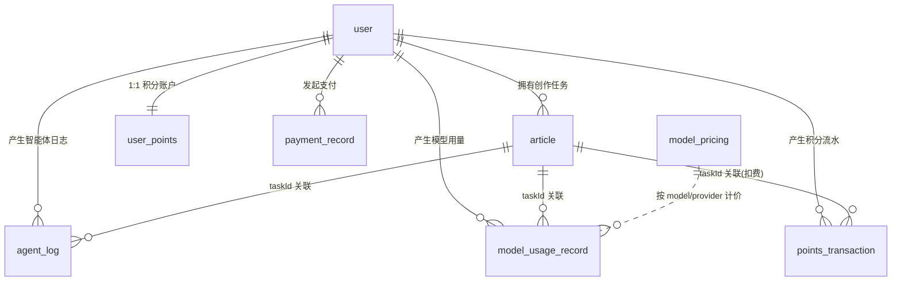

# 数据库说明文档

> 项目：AI 文章创作平台（passageAI）
> 业务数据库：MySQL `ai_passage_creator`（utf8mb4 / utf8mb4_unicode_ci）
> 文档依据：`backend/app/models/`（SQLAlchemy ORM，权威定义）+ `backend/sql/`（建表 / 迁移脚本）

## 1. 总览

系统业务数据统一存放在 MySQL 数据库 `ai_passage_creator` 中，共 **8 张表**，按领域可分为四组：

| 分组 | 表名 | 中文名 | 职责 |
| :--- | :--- | :--- | :--- |
| 用户域 | `user` | 用户表 | 账号、角色、配额、会员、并发任务计数 |
| 创作域 | `article` | 文章表 | 创作任务与文章产物（标题/大纲/正文/配图） |
| 创作域 | `agent_log` | 智能体执行日志表 | 记录每个 LLM 智能体节点的执行明细 |
| 支付域 | `payment_record` | 支付记录表 | Stripe 开通永久 VIP 的支付流水 |
| 积分域 | `user_points` | 用户积分账户表 | 积分余额（权威）与累计统计 |
| 积分域 | `points_transaction` | 积分流水表 | 每笔积分变动明细 |
| 积分域 | `model_pricing` | 模型计价表 | 各 LLM / 生图模型的积分单价配置 |
| 积分域 | `model_usage_record` | 模型用量记录表 | 各用户各任务的模型调用/token/图片用量与成本 |

### 1.1 实体关系（ER）



> 说明：`agent_log`、`model_usage_record`、`points_transaction` 均通过 `taskId`（即 `article.taskId`）关联到创作任务；ORM 模型层未声明外键，关联关系由业务代码维护。

### 1.2 其他存储（非 MySQL）

| 存储 | 用途 |
| :--- | :--- |
| Redis | 用户 Session、任务去重键（`dedup:article:{userId}:{fingerprint}`）、配额信号量、管理统计缓存 |
| SQLite | LangGraph 图检查点（`backend/data/checkpoints.sqlite`），支撑 interrupt 断点续跑 |
| 本地文件 | 生成图片落盘（`backend/static/images/`），`/static` 挂载对外访问 |

---

## 2. 表结构

### 2.1 user — 用户表

**负责内容**：账号体系（注册/登录）、角色权限、创作配额、会员信息，以及并发创作任务计数。

| 列名(DB) | ORM 字段 | 类型 | 约束 | 说明 |
| :--- | :--- | :--- | :--- | :--- |
| id | id | BIGINT | PK, AUTO_INCREMENT | 主键 |
| userAccount | user_account | VARCHAR(256) | NOT NULL, UNIQUE | 登录账号 |
| userPassword | user_password | VARCHAR(512) | NOT NULL | 密码（MD5 + 盐） |
| userName | user_name | VARCHAR(256) | NULL | 用户昵称 |
| userAvatar | user_avatar | VARCHAR(1024) | NULL | 头像 URL |
| userProfile | user_profile | VARCHAR(512) | NULL | 用户简介 |
| userRole | user_role | VARCHAR(256) | NOT NULL, DEFAULT 'user' | 角色：`user` / `admin` / `vip` |
| quota | quota | INT | NOT NULL, DEFAULT 5 | 剩余创作配额（普通用户，VIP 不受限），逐步废弃，由积分取代 |
| points | points | INT | NOT NULL, DEFAULT 0 | 积分余额（**冗余展示**，权威以 `user_points.balance` 为准） |
| activeTaskCount | active_task_count | INT | NOT NULL, DEFAULT 0 | 进行中创作任务数（含挂起，MySQL 权威原子计数，用于并发限制） |
| vipTime | vip_time | DATETIME | NULL | 成为会员时间 |
| editTime | edit_time | DATETIME | NOT NULL | 编辑时间 |
| createTime | create_time | DATETIME | NOT NULL, DEFAULT CURRENT_TIMESTAMP | 创建时间 |
| updateTime | update_time | DATETIME | NOT NULL, ON UPDATE CURRENT_TIMESTAMP | 更新时间 |
| isDelete | is_delete | TINYINT | NOT NULL, DEFAULT 0 | 逻辑删除标记 |

**索引**：`uk_userAccount`（账号唯一）、`idx_userName`。

**关键点**：`user.points` 与 `user_points.balance` 为冗余双写（同步脚本见 `backend/sql/add_points_system.sql` 第 11 节）；`activeTaskCount` 由任务创建/结束时的原子 SQL 维护，防止并发超限。

---

### 2.2 article — 文章表

**负责内容**：核心创作域。一条记录对应一次「输入主题 → 生成图文文章」的完整创作任务，贯穿 LangGraph 状态机全流程，记录选题、标题方案、大纲、正文、配图、状态与阶段。

| 列名(DB) | ORM 字段 | 类型 | 约束 | 说明 |
| :--- | :--- | :--- | :--- | :--- |
| id | id | BIGINT | PK, AUTO_INCREMENT | 主键 |
| taskId | task_id | VARCHAR(64) | NOT NULL, UNIQUE | 任务 ID（UUID），贯穿整个生成流水线，也是 SSE / 断点续跑的标识 |
| userId | user_id | BIGINT | NOT NULL | 所属用户 ID |
| topic | topic | VARCHAR(500) | NOT NULL | 选题 |
| userDescription | user_description | TEXT | NULL | 用户补充描述 |
| mainTitle | main_title | VARCHAR(200) | NULL | 主标题 |
| subTitle | sub_title | VARCHAR(300) | NULL | 副标题 |
| titleOptions | title_options | TEXT(JSON) | NULL | 标题方案列表（3~5 个，待用户确认） |
| outline | outline | TEXT(JSON) | NULL | 大纲（JSON 格式） |
| content | content | TEXT | NULL | 正文（Markdown 格式） |
| fullContent | full_content | TEXT | NULL | 完整图文（Markdown 格式，已合并配图） |
| coverImage | cover_image | VARCHAR(512) | NULL | 封面图 URL |
| images | images | TEXT(JSON) | NULL | 配图列表（JSON 数组） |
| enabledImageMethods | enabled_image_methods | TEXT(JSON) | NULL | 用户允许的配图方式列表 |
| status | status | VARCHAR(20) | NOT NULL, DEFAULT 'PENDING' | 文章状态：`PENDING/PROCESSING/COMPLETED/FAILED` |
| phase | phase | VARCHAR(40) | NOT NULL, DEFAULT 'PENDING' | 生成阶段：见 §3.2 |
| genre | genre | VARCHAR(20) | NULL | 题材：`news/knowledge/product/tutorial/opinion/story`（news 触发信息采集） |
| languageStyle | language_style | VARCHAR(20) | NULL | 语言风格：`professional/accessible/humorous/literary/formal` |
| wordCount | word_count | INT | NULL | 目标字数（<=10000） |
| style | style | VARCHAR(20) | NULL | 旧文章风格（**已弃用**，仅兼容存量数据，新流程不读写） |
| errorMessage | error_message | TEXT | NULL | 失败时的错误信息 |
| createTime | create_time | DATETIME | NOT NULL, DEFAULT CURRENT_TIMESTAMP | 创建时间 |
| completedTime | completed_time | DATETIME | NULL | 完成时间 |
| updateTime | update_time | DATETIME | NOT NULL, ON UPDATE CURRENT_TIMESTAMP | 更新时间 |
| isDelete | is_delete | TINYINT | NOT NULL, DEFAULT 0 | 逻辑删除标记 |

**索引**：`uk_taskId`、`idx_userId`、`idx_status`、`idx_createTime`、`idx_userId_status`。

**关键点**：`status` 表示整篇文章的宏观状态，`phase` 表示流水线内部所处阶段（细粒度）；二者配合用于前端进度展示与断点恢复判断。

---

### 2.3 payment_record — 支付记录表

**负责内容**：记录用户通过 Stripe 支付开通「永久 VIP」的每一笔订单，包括会话、支付意向、金额、状态与退款信息，是支付对账与退款处理的数据源。

| 列名(DB) | ORM 字段 | 类型 | 约束 | 说明 |
| :--- | :--- | :--- | :--- | :--- |
| id | id | BIGINT | PK, AUTO_INCREMENT | 主键 |
| userId | user_id | BIGINT | NOT NULL | 用户 ID |
| stripeSessionId | stripe_session_id | VARCHAR(128) | NULL | Stripe Checkout Session ID |
| stripePaymentIntentId | stripe_payment_intent_id | VARCHAR(128) | NULL | Stripe PaymentIntent ID（退款时使用） |
| amount | amount | DECIMAL(10,2) | NOT NULL | 金额（美元） |
| currency | currency | VARCHAR(8) | NOT NULL, DEFAULT 'usd' | 货币 |
| status | status | VARCHAR(32) | NOT NULL | 支付状态：`PENDING/SUCCEEDED/FAILED/REFUNDED` |
| productType | product_type | VARCHAR(32) | NOT NULL | 产品类型：`VIP_PERMANENT`（永久会员） |
| description | description | VARCHAR(256) | NULL | 描述 |
| refundTime | refund_time | DATETIME | NULL | 退款时间 |
| refundReason | refund_reason | VARCHAR(512) | NULL | 退款原因 |
| createTime | create_time | DATETIME | NOT NULL, DEFAULT CURRENT_TIMESTAMP | 创建时间 |
| updateTime | update_time | DATETIME | NOT NULL, ON UPDATE CURRENT_TIMESTAMP | 更新时间 |

**索引**：`idx_userId`、`idx_stripeSessionId`、`idx_status`、`idx_createTime`。

**关键点**：Stripe webhook 回调更新 `status`，成功后联动升级 `user.userRole = 'vip'` 并写入 `vipTime`。

---

### 2.4 agent_log — 智能体执行日志表

**负责内容**：记录每个 LLM 智能体节点（标题 / 大纲 / 正文 / 配图分析 / 配图生成 / 内容合并 / 信息采集）的一次执行明细，包括 Prompt、输入输出、耗时、状态与模型，用于执行追踪与问题排查。

| 列名(DB) | ORM 字段 | 类型 | 约束 | 说明 |
| :--- | :--- | :--- | :--- | :--- |
| id | id | BIGINT | PK, AUTO_INCREMENT | 主键 |
| taskId | task_id | VARCHAR(64) | NOT NULL | 任务 ID（关联 article.taskId） |
| userId | user_id | BIGINT | NULL | 用户 ID |
| agentName | agent_name | VARCHAR(64) | NOT NULL | 智能体名称（如 title/outline/content/info_collector_main） |
| model | model | VARCHAR(64) | NULL | 使用的模型名 |
| startTime | start_time | DATETIME | NOT NULL | 开始时间 |
| endTime | end_time | DATETIME | NULL | 结束时间 |
| durationMs | duration_ms | INT | NULL | 耗时（毫秒） |
| status | status | VARCHAR(20) | NOT NULL | 状态：`RUNNING/SUCCESS/FAILED` |
| errorMessage | error_message | TEXT | NULL | 错误信息 |
| prompt | prompt | TEXT | NULL | 使用的 Prompt |
| inputData | input_data | TEXT(JSON) | NULL | 输入数据（JSON） |
| outputData | output_data | TEXT(JSON) | NULL | 输出数据（JSON） |
| createTime | create_time | DATETIME | NOT NULL, DEFAULT CURRENT_TIMESTAMP | 创建时间 |
| updateTime | update_time | DATETIME | NOT NULL, ON UPDATE CURRENT_TIMESTAMP | 更新时间 |
| isDelete | is_delete | TINYINT | NOT NULL, DEFAULT 0 | 逻辑删除标记 |

**索引**：`idx_taskId`、`idx_agentName`、`idx_status`、`idx_createTime`。

---

### 2.5 user_points — 用户积分账户表

**负责内容**：每个用户的积分账户，`balance` 为**权威积分余额**；`version` 乐观锁用于防止并发超扣。与 `user` 表 1:1（`userId` 唯一）。

| 列名(DB) | ORM 字段 | 类型 | 约束 | 说明 |
| :--- | :--- | :--- | :--- | :--- |
| id | id | BIGINT | PK, AUTO_INCREMENT | 主键 |
| userId | user_id | BIGINT | NOT NULL, UNIQUE | 用户 ID（每用户一条） |
| balance | balance | INT | NOT NULL, DEFAULT 0 | 当前积分余额（权威） |
| totalEarned | total_earned | INT | NOT NULL, DEFAULT 0 | 累计获得积分 |
| totalConsumed | total_consumed | INT | NOT NULL, DEFAULT 0 | 累计消耗积分 |
| version | version | INT | NOT NULL, DEFAULT 0 | 乐观锁版本号 |
| createTime | create_time | DATETIME | NOT NULL, DEFAULT CURRENT_TIMESTAMP | 创建时间 |
| updateTime | update_time | DATETIME | NOT NULL, ON UPDATE CURRENT_TIMESTAMP | 更新时间 |

**索引**：`uk_userId`。

**关键点**：注册即赠送 100 积分（`PointsConstant.DEFAULT_POINTS`，注册事务内发放）；`points_service` 通过 `SELECT ... FOR UPDATE` + `version` 乐观锁保证并发安全。

---

### 2.6 points_transaction — 积分流水表

**负责内容**：记录每笔积分变动（获得 / 消耗），是可追溯的积分明细账。`amount` 为正表示获得、为负表示消耗，`balanceAfter` 为变动后余额。

| 列名(DB) | ORM 字段 | 类型 | 约束 | 说明 |
| :--- | :--- | :--- | :--- | :--- |
| id | id | BIGINT | PK, AUTO_INCREMENT | 主键 |
| userId | user_id | BIGINT | NOT NULL | 用户 ID |
| taskId | task_id | VARCHAR(64) | NULL | 关联任务 ID（生成类流水必填） |
| type | type | VARCHAR(32) | NOT NULL | 流水类型：见 §3.5 |
| amount | amount | INT | NOT NULL | 变动积分（正=获得，负=消耗） |
| balanceAfter | balance_after | INT | NOT NULL | 变动后余额 |
| description | description | VARCHAR(255) | NULL | 描述 |
| createTime | create_time | DATETIME | NOT NULL, DEFAULT CURRENT_TIMESTAMP | 创建时间 |

**索引**：`idx_userId_time`（userId, createTime）、`idx_taskId`。

---

### 2.7 model_pricing — 模型计价表

**负责内容**：配置各 LLM / AI 生图模型的积分单价（LLM 按每 1k token 计价，生图按每张计价），供用量结算时计算积分成本；管理端可增删改查。

| 列名(DB) | ORM 字段 | 类型 | 约束 | 说明 |
| :--- | :--- | :--- | :--- | :--- |
| id | id | BIGINT | PK, AUTO_INCREMENT | 主键 |
| category | category | VARCHAR(16) | NOT NULL | 类别：`LLM` / `IMAGE` |
| provider | provider | VARCHAR(32) | NOT NULL | 提供商（如 Xiaomi / DeepSeek / Zhipu / NanoBanana） |
| model | model | VARCHAR(64) | NOT NULL | 模型名（LLM 可用通配符 `*` 兜底） |
| agentName | agent_name | VARCHAR(50) | NOT NULL, DEFAULT '' | 按智能体细分（空串 = 不限） |
| inputPricePer1k | input_price_per_1k | DECIMAL(10,4) | NOT NULL, DEFAULT 0 | 输入 token 单价（积分/1k token，LLM） |
| outputPricePer1k | output_price_per_1k | DECIMAL(10,4) | NOT NULL, DEFAULT 0 | 输出 token 单价（积分/1k token，LLM） |
| pricePerImage | price_per_image | DECIMAL(10,2) | NOT NULL, DEFAULT 0 | 每张图积分（IMAGE） |
| enabled | enabled | TINYINT | NOT NULL, DEFAULT 1 | 是否启用 |
| updateTime | update_time | DATETIME | NOT NULL, ON UPDATE CURRENT_TIMESTAMP | 更新时间 |

**索引**：`uk_model`（category, provider, model, agentName）唯一。

**关键点**：计价规则「100 积分 = 1 元」；已内置种子数据（见 `backend/sql/add_points_system.sql` 第 6 节），如小米 mimo 系列、DeepSeek、智谱生图、Nano Banana 等。

---

### 2.8 model_usage_record — 模型用量记录表

**负责内容**：记录每个用户每次任务中各 LLM / AI 生图模型的调用次数、token 消耗、图片张数、耗时与积分成本，是「各模型使用情况统计」与积分结算的核心表。

| 列名(DB) | ORM 字段 | 类型 | 约束 | 说明 |
| :--- | :--- | :--- | :--- | :--- |
| id | id | BIGINT | PK, AUTO_INCREMENT | 主键 |
| userId | user_id | BIGINT | NOT NULL | 用户 ID |
| taskId | task_id | VARCHAR(64) | NULL | 任务 ID |
| category | category | VARCHAR(16) | NOT NULL | 类别：`LLM` / `IMAGE` |
| provider | provider | VARCHAR(32) | NOT NULL | 提供商：Xiaomi / DeepSeek / Zhipu / NanoBanana |
| model | model | VARCHAR(64) | NOT NULL | 模型名（如 mimo-v2.5-pro / cogview-3-flash） |
| agentName | agent_name | VARCHAR(50) | NULL | 智能体名称（如 title/outline/content/info_collector_main） |
| callCount | call_count | INT | NOT NULL, DEFAULT 1 | 调用次数 |
| inputTokens | input_tokens | INT | NULL | 输入 token 数（LLM） |
| outputTokens | output_tokens | INT | NULL | 输出 token 数（LLM） |
| imageCount | image_count | INT | NULL | 生成图片张数（IMAGE） |
| costPoints | cost_points | INT | NOT NULL, DEFAULT 0 | 本记录消耗积分 |
| status | status | VARCHAR(16) | NOT NULL, DEFAULT 'SUCCESS' | 状态：`SUCCESS/FAILED` |
| startTime | start_time | DATETIME | NOT NULL | 开始时间 |
| endTime | end_time | DATETIME | NULL | 结束时间 |
| createTime | create_time | DATETIME | NOT NULL, DEFAULT CURRENT_TIMESTAMP | 创建时间 |

**索引**：`idx_userId_model`（userId, model, createTime）、`idx_taskId`。

---

## 3. 枚举与状态取值

### 3.1 文章状态（article.status）

| 取值 | 含义 |
| :--- | :--- |
| PENDING | 待处理（任务刚创建） |
| PROCESSING | 生成中 |
| COMPLETED | 已完成 |
| FAILED | 失败（含 errorMessage） |

### 3.2 文章阶段（article.phase）

| 取值 | 含义 |
| :--- | :--- |
| PENDING | 待处理 |
| TITLE_GENERATING | 生成标题 |
| TITLE_SELECTING | 等待用户选择标题（interrupt） |
| OUTLINE_GENERATING | 生成大纲 |
| OUTLINE_EDITING | 编辑大纲 / AI 改大纲（interrupt） |
| CONTENT_GENERATING | 生成正文 |

阶段流转：`PENDING → TITLE_GENERATING → TITLE_SELECTING → OUTLINE_GENERATING → OUTLINE_EDITING → CONTENT_GENERATING`（见 `enums.py` 的 `ArticlePhaseEnum.can_transition_to`）。

### 3.3 支付状态（payment_record.status）

`PENDING`（待支付）/ `SUCCEEDED`（成功）/ `FAILED`（失败）/ `REFUNDED`（已退款）。

### 3.4 产品类型（payment_record.productType）

`VIP_PERMANENT`（永久会员，售价 1.99 USD，来源 `ProductTypeEnum`）。

### 3.5 积分流水类型（points_transaction.type）

| 取值 | 含义 | 状态 |
| :--- | :--- | :--- |
| REGISTER | 注册赠送 | 使用中 |
| SIGN_IN | 每日签到 | 使用中 |
| RECHARGE | 充值 | 暂未实现 |
| USAGE_SETTLE | 生成任务段级结算（后付费扣费） | 使用中（v1.3 起） |
| USAGE_RESERVE | 生成任务预扣 | **已废弃**（v1.2 遗留，兼容保留） |
| USAGE_REFUND | 失败退回 | **已废弃**（v1.2 遗留，兼容保留） |
| ADMIN_ADJUST | 管理员调整 / 历史配额折算 | 使用中 |

### 3.6 用户角色（user.userRole）

`user`（普通用户）/ `admin`（管理员）/ `vip`（永久会员，由支付开通）。

### 3.7 题材 / 语言风格 / 旧风格（article）

- 题材 `genre`：`news`（新闻，触发信息采集）/ `knowledge`（知识科普）/ `product`（产品介绍）/ `tutorial`（教程指南）/ `opinion`（观点评论）/ `story`（故事叙事）
- 语言风格 `languageStyle`：`professional` / `accessible` / `humorous` / `literary` / `formal`
- 旧风格 `style`（已弃用）：`tech` / `emotional` / `educational` / `humorous`

### 3.8 配图方式（article.enabledImageMethods 取值，来自 ImageMethodEnum）

`PEXELS` / `NANO_BANANA` / `ZHIPU` / `MERMAID` / `ICONIFY` / `EMOJI_PACK` / `SVG_DIAGRAM`；`PICSUM` 为降级兜底（不向用户暴露）。

---

## 4. 关键业务流转

### 4.1 文章创作流水线

```
POST /api/article/create
  → 写入 article（status=PENDING, phase=PENDING，taskId=UUID）
  → 原子递增 user.activeTaskCount
  → 启动 LangGraph 任务
      bootstrap → (新闻? research) → generate_title → confirm_title[⏸]
      → generate_outline → confirm_outline[⏸] → (ai_modify_outline 循环)
      → generate_content → image_analyzer → image_generator → merger → finalize
  → 各智能体节点写入 agent_log（执行明细）
  → 完成：status=COMPLETED, phase=CONTENT_GENERATING, completedTime=NOW()
  → 原子递减 user.activeTaskCount
```

- 断点（interrupt）由 SQLite checkpointer 持久化，用户确认标题/大纲后 `resume()` 继续。
- 失败时由 `article_async_service._handle_failure` 兜底，写 `errorMessage`、`status=FAILED`，并释放并发计数。

### 4.2 积分与结算

```
注册 → user_points 建户(balance=100) + points_transaction(REGISTER, +100)
生成任务 → 每次 LLM/生图调用写入 model_usage_record（含 token/张数）
        → 依据 model_pricing 计价 → 段级结算扣费
        → points_transaction(USAGE_SETTLE, -n) + user_points.balance 扣减（行锁 + version 乐观锁）
        → 同步 user.points 冗余展示字段
```

### 4.3 VIP 支付

```
用户选择 VIP_PERMANENT → 创建 Stripe Checkout Session
  → 落库 payment_record（status=PENDING）
Stripe webhook 回调（checkout.session.completed）
  → payment_record.status=SUCCEEDED
  → user.userRole='vip', user.vipTime=NOW()
```

### 4.4 配额与并发限制

- 普通用户每次创建消耗 1 次 `quota`（VIP 不受限）。
- `user.activeTaskCount` 为进行中任务数，通过原子 SQL 维护，防止单用户并发创建超限。

---

## 5. 命名与约定

1. **列名**：MySQL 表列统一 camelCase（如 `taskId`、`createTime`）；ORM 字段用 snake_case，通过 `Column("camelCase", ...)` 显式映射。
2. **逻辑删除**：业务表均含 `isDelete`（TINYINT，0=正常，1=删除），查询默认过滤 `isDelete = 0`。
3. **时间字段**：`createTime` / `updateTime` 由数据库默认值 / ON UPDATE 维护；业务时间（如 `completedTime`、`vipTime`）由代码写入。
4. **大字段**：正文、大纲、JSON 数据等使用 `TEXT` / `JSON` 类型。
5. **外键**：ORM 层不声明物理外键，表间关系由 `userId` / `taskId` 在业务代码中维护。
6. **货币与金额**：支付金额用 `DECIMAL(10,2)`（美元）；积分单价用 `DECIMAL(10,4)`（每 1k token）。

---

## 6. 相关文件索引

| 文件 | 说明 |
| :--- | :--- |
| `backend/app/models/user.py` | 用户表 ORM |
| `backend/app/models/article.py` | 文章表 ORM |
| `backend/app/models/payment.py` | 支付记录表 ORM |
| `backend/app/models/agent_log.py` | 智能体执行日志表 ORM |
| `backend/app/models/user_points.py` | 用户积分账户表 ORM |
| `backend/app/models/points_transaction.py` | 积分流水表 ORM |
| `backend/app/models/model_pricing.py` | 模型计价表 ORM |
| `backend/app/models/model_usage_record.py` | 模型用量记录表 ORM |
| `backend/app/models/enums.py` | 全部状态/类型枚举（文章、支付、配图、阶段、积分） |
| `backend/sql/create_table.sql` | 建库 + user / agent_log 建表 + 测试数据 |
| `backend/sql/create_article_table.sql` | article 建表 |
| `backend/sql/update_quota.sql` | user 加 quota 字段 |
| `backend/sql/add_vip_payment.sql` | user 加 vipTime + payment_record 建表 |
| `backend/sql/add_genre_fields.sql` | article 加 genre / languageStyle / wordCount |
| `backend/sql/add_phase_fields.sql` | article 加 phase / titleOptions / userDescription / enabledImageMethods |
| `backend/sql/add_points_system.sql` | 积分域 4 表建表 + 计价种子数据 + 存量回填（幂等） |
| `backend/app/services/points_service.py` | 积分账户服务（行锁 + 乐观锁） |
| `backend/app/services/payment_service.py` | 支付服务 |
| `backend/app/services/statistics_service.py` | 管理端统计（基于 article / user 聚合） |

> 注意：`backend/sql/*.sql` 为手动执行的建表/迁移脚本（无迁移框架），新增字段时需同步更新对应 ORM 模型；ORM 模型是权威定义。
